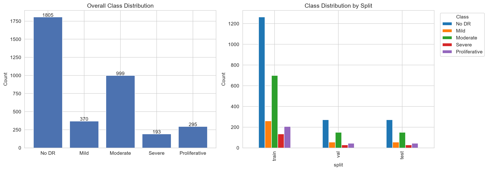
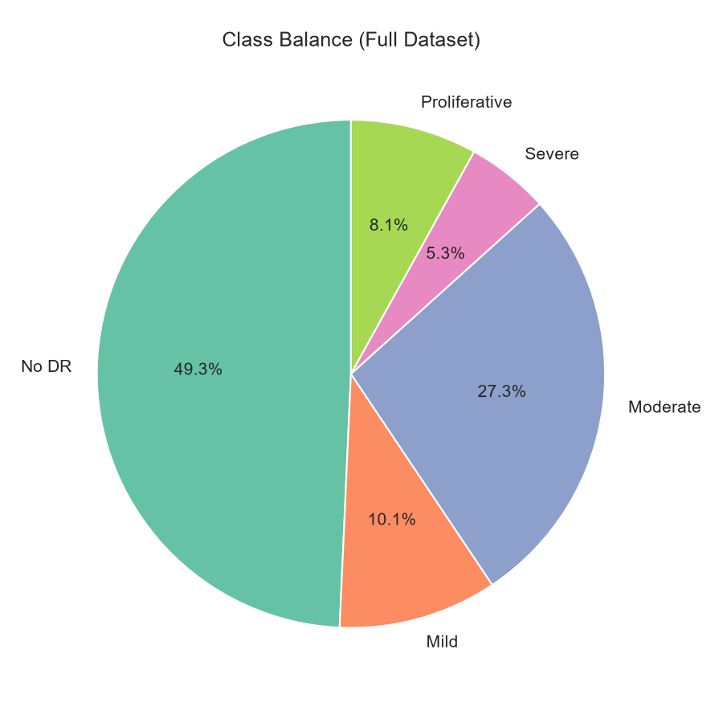
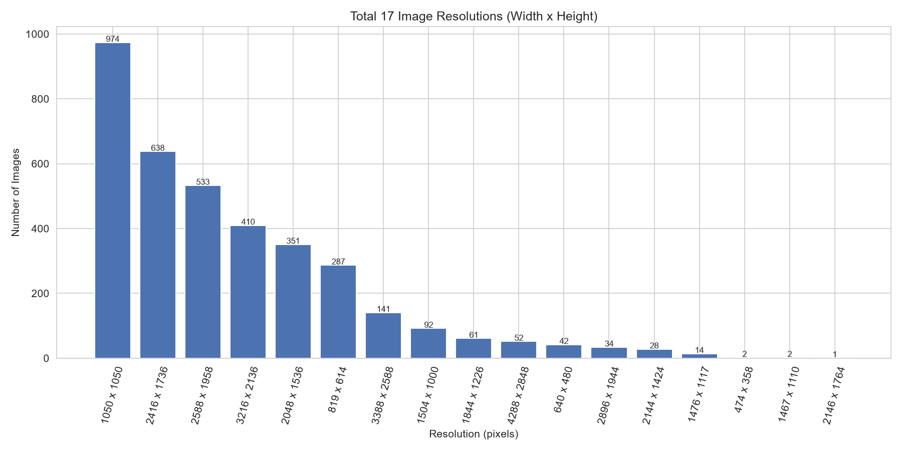
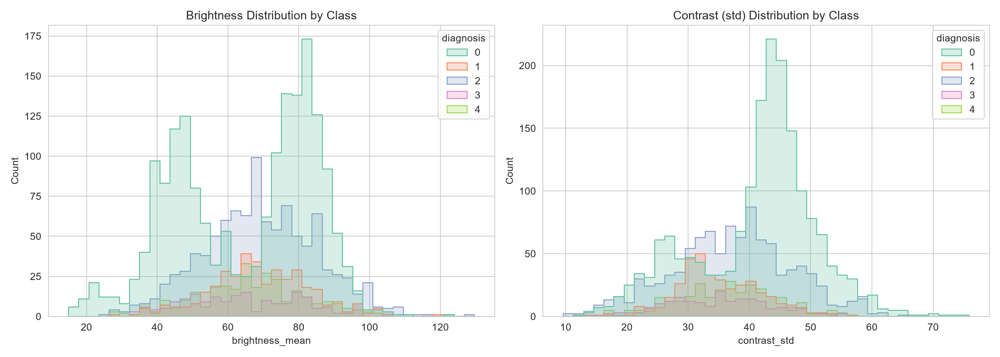
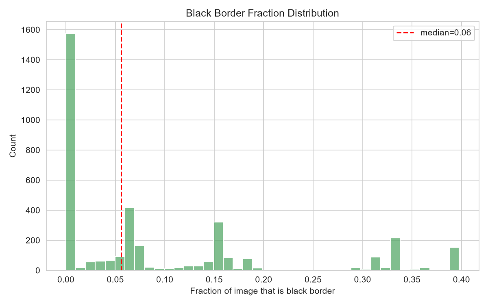
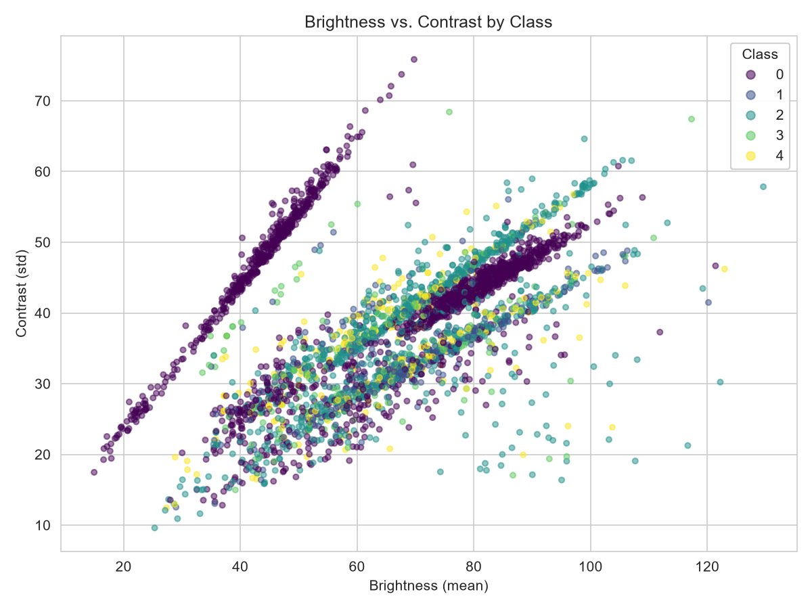
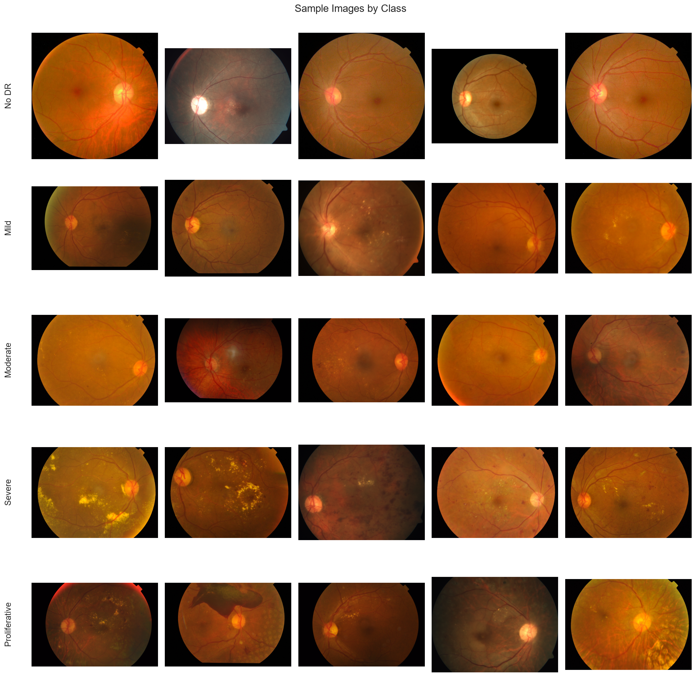

# Exploratory Data Analysis Report

## APTOS 2019 Blindness Detection Dataset

**Source notebook:** `01_eda.ipynb`

**Dataset paths used by the notebook:**

- Labels: `aptos2019/dataset.csv`
- Images: `aptos2019/images/`
- Shared split: `data/splits/aptos_seed42.csv`
- EDA figures: `studies/01_eda/figures/`

---

## 1. Dataset description

The dataset contains **3,662 retinal fundus images** labelled for diabetic retinopathy severity. Each row in the labels file contains an image identifier (`id_code`) and an ordinal diagnosis label (`diagnosis`). The five classes are:

| Label | Class name    | Meaning                            |
| ----: | ------------- | ---------------------------------- |
|     0 | No DR         | No visible diabetic retinopathy    |
|     1 | Mild          | Mild diabetic retinopathy          |
|     2 | Moderate      | Moderate diabetic retinopathy      |
|     3 | Severe        | Severe diabetic retinopathy        |
|     4 | Proliferative | Proliferative diabetic retinopathy |

The label is **ordinal**, meaning that the classes have a natural order from 0 to 4. However, the numerical mean of the diagnosis column should not be interpreted as an “average patient stage,” because it is strongly affected by class imbalance and does not describe an individual clinical condition.

The notebook uses a fixed, stratified split with seed 42:

| Split           |          Images | Approximate share | Purpose                                            |
| --------------- | --------------: | ----------------: | -------------------------------------------------- |
| Train           |           2,563 |               70% | Used to fit model parameters                       |
| Validation      |             549 |               15% | Used for model monitoring and checkpoint selection |
| Test            |             550 |               15% | Held back for final unbiased evaluation            |
| **Total** | **3,662** |    **100%** |                                                    |

A stratified split preserves approximately the same class proportions in train, validation, and test data. This is especially important here because the dataset is imbalanced.

---

## 2. Data and path checks

The notebook confirmed:

- `Labels CSV exists: True`
- `Image dir exists: True`
- **Missing image files: 0**
- **Unreadable image files: 0**

Every label has a corresponding readable image file. This means the later EDA and preprocessing results are based on the full set of 3,662 labelled images rather than a reduced subset.

Missing or corrupted files can silently reduce class counts, bias summary statistics, or cause training failures. Since no files are missing or unreadable, the class distribution and image-quality summaries can be treated as complete for this dataset copy.

---

## 3. Shared train-validation-test split

The existing split file was reused rather than regenerated. The class counts are:

| Class           |           Train |    Validation |          Test |           Total | Share of dataset |
| --------------- | --------------: | ------------: | ------------: | --------------: | ---------------: |
| No DR           |           1,263 |           271 |           271 |           1,805 |            49.3% |
| Mild            |             259 |            55 |            56 |             370 |            10.1% |
| Moderate        |             699 |           150 |           150 |             999 |            27.3% |
| Severe          |             135 |            29 |            29 |             193 |             5.3% |
| Proliferative   |             207 |            44 |            44 |             295 |             8.1% |
| **Total** | **2,563** | **549** | **550** | **3,662** |   **100%** |

The split proportions are very consistent. For example, the validation and test sets each contain 271 No DR images, 150 Moderate images, 29 Severe images, and 44 Proliferative images. This confirms that stratification worked.

The train set is much larger because it must provide enough examples for learning. Validation and test sets are smaller because their role is measurement rather than fitting. Minor one-image differences, such as Mild having 55 validation and 56 test images, occur because integer counts cannot always be divided perfectly.

---

## 4. Overall class distribution

The left chart shows total images per class. The right chart shows the same distribution within the train, validation, and test splits.

### What it implies

- **No DR is the majority class**, with 1,805 images, almost half of the dataset.
- **Severe is the smallest class**, with only 193 images.
- Moderate is the second-largest class, while Mild and Proliferative are also underrepresented.
- The same pattern appears in all three splits, confirming stratification.

A model can obtain a deceptively high overall accuracy by predicting the majority class frequently. Therefore, accuracy alone is not sufficient. Metrics such as **macro F1**, **balanced accuracy**, per-class recall, and **Quadratic Weighted Kappa (QWK)** are more informative because they reduce the dominance of the largest class or respect the ordinal label structure.

### Modelling implication

Minority classes, especially Severe and Proliferative, may be harder to learn because the model sees fewer examples. Later experiments should examine per-class recall and confusion matrices rather than relying only on overall accuracy.

---

## 5. Class balance as percentages

This chart expresses the same class counts as proportions of the full dataset.

Approximately:

- 49.3% of images are No DR
- 27.3% are Moderate
- 10.1% are Mild
- 8.1% are Proliferative
- 5.3% are Severe

### Why this view is useful

The bar chart is better for comparing exact counts, while the pie chart makes the overall imbalance immediately visible. Nearly three-quarters of the dataset belongs to only two classes: No DR and Moderate.

### Important caution

The chart does not indicate model performance. It only shows how often each label appears. A large slice does not mean that class is easier in a medical sense; it means the model has more training examples from that class.

---

## 6. Image-level quality scan

The notebook measured image dimensions, aspect ratio, brightness, contrast, and estimated black-border fraction.

| Statistic          |   Height |    Width | Aspect ratio | Mean brightness | Contrast standard deviation | Black-border fraction |
| ------------------ | -------: | -------: | -----------: | --------------: | --------------------------: | --------------------: |
| Mean               | 1,526.83 | 2,015.18 |        1.284 |           66.79 |                       38.81 |                0.0925 |
| Standard deviation |   542.66 |   884.30 |        0.182 |           17.98 |                        9.74 |                0.1195 |
| Minimum            |      358 |      474 |        1.000 |           14.97 |                        9.61 |                0.0000 |
| 25th percentile    |    1,050 |    1,050 |        1.000 |           52.07 |                       31.65 |                0.0000 |
| Median             |    1,536 |    2,144 |        1.333 |           68.97 |                       40.13 |                0.0560 |
| 75th percentile    |    1,958 |    2,588 |        1.392 |           80.84 |                       45.41 |                0.1558 |
| Maximum            |    2,848 |    4,288 |        1.506 |          129.62 |                       75.85 |                0.3977 |

1. **Image size varies substantially.** The smallest image is 474 × 358 pixels, while the largest is 4,288 × 2,848 pixels.
2. **Brightness varies strongly.** Some images are extremely dark, while others are much brighter.
3. **Contrast also varies.** Low-contrast images may hide fine lesions or vessel detail.
4. **Black borders are common but uneven.** The mean is about 9.3%, the median is 5.6%, and some images contain almost 40% estimated border.

The dataset appears to combine images captured using different devices, resolutions, framing styles, and illumination conditions. Retinal photography naturally produces a circular retinal field surrounded by dark background, but the amount of unused border changes depending on camera framing.

### Preprocessing implication

A consistent preprocessing pipeline should crop the retinal field, resize all images to a common input size, and avoid allowing camera-specific brightness, resolution, or border patterns to become shortcuts for prediction.

---

## 7. Resolution distribution

The dataset contains **17 distinct resolutions**:

| Resolution (width × height) | Images |
| ---------------------------- | -----: |
| 1,050 × 1,050               |    974 |
| 2,416 × 1,736               |    638 |
| 2,588 × 1,958               |    533 |
| 3,216 × 2,136               |    410 |
| 2,048 × 1,536               |    351 |
| 819 × 614                   |    287 |
| 3,388 × 2,588               |    141 |
| 1,504 × 1,000               |     92 |
| 1,844 × 1,226               |     61 |
| 4,288 × 2,848               |     52 |
| 640 × 480                   |     42 |
| 2,896 × 1,944               |     34 |
| 2,144 × 1,424               |     28 |
| 1,476 × 1,117               |     14 |
| 474 × 358                   |      2 |
| 1,467 × 1,110               |      2 |
| 2,146 × 1,764               |      1 |

The dataset is heterogeneous, but not randomly sized. Most images belong to a small number of repeated resolution groups. This suggests that several camera or export configurations were used.

### Preprocessing implication

Resizing is mandatory because neural networks require a fixed input shape. However, cropping the retinal field before resizing is preferable to resizing the full raw frame because it reduces empty border and makes the retinal content occupy more of the final image.

---

## 8. Brightness and contrast distributions by class

### What the charts show

- The left chart shows mean image brightness for every diagnosis class.
- The right chart shows grayscale contrast, measured as pixel-intensity standard deviation.

The distributions overlap heavily across all five classes. There is no clean brightness or contrast boundary that separates disease grades.

This is a positive finding because it reduces concern that the label could be guessed using a simple illumination shortcut. The model will still need to learn retinal structures and lesion patterns.

### Why the No DR curve appears larger

No DR has far more images than the other classes. The chart uses raw counts rather than density-normalised curves, so its outline is naturally taller. A taller line does not necessarily mean greater brightness variability; it partly reflects the larger sample size.

### Why brightness and contrast still matter

Even though they do not separate classes, large acquisition differences can make training harder. The same lesion may appear very different in a dark image and a bright image. This provides a reason to test controlled contrast or illumination preprocessing, such as CLAHE or gamma correction.

---

## 9. Black-border fraction

The x-axis is the estimated proportion of each raw image occupied by dark border. The dashed red line marks the median, approximately 0.056.

- At least 25% of images have essentially no removable rectangular border under the selected threshold.
- Half of the images have 5.6% border or less.
- The mean is higher than the median because a smaller group of images has very large borders.
- The maximum is close to 40%, showing that some raw images contain substantial unused space.

### Why the distribution is right-skewed

Most images are already framed reasonably tightly, but a smaller number were captured or exported with much wider dark margins. Those extreme cases pull the mean upward.

### Modelling implication

Without cropping, a model may waste input pixels on empty background. Cropping before resizing increases the effective retinal resolution and reduces variation unrelated to disease.

---

## 10. Brightness versus contrast scatter plot

Each point represents one image:

- x-axis: mean brightness
- y-axis: contrast standard deviation
- colour: diagnosis class

The class colours are mixed throughout the plot rather than forming isolated clusters. Brightness and contrast alone are therefore insufficient for diagnosis grading.

The main cloud also shows a relationship between acquisition conditions: very dark images often have lower usable contrast, while brighter images cover a broader contrast range.

### Why outliers matter

Points far from the main cluster may represent:

- underexposed images
- overexposed images
- low-contrast images
- unusual camera settings
- images that may require manual quality review

### Important caution

An outlier is not automatically corrupted or mislabelled. It is only a candidate for inspection. Some genuine retinal conditions or imaging artefacts can also create unusual brightness and contrast.

---

## 11. Sample images by class

Each row contains five training images from one diagnosis class, ordered from No DR to Proliferative.

### What it implies

1. **Within-class appearance varies considerably.** Images in the same class differ in colour, exposure, crop, and visible retinal detail.
2. **Between-class differences can be subtle.** Adjacent grades may not have visually obvious differences to a non-specialist.
3. **Image-quality variation exists in every class.** This supports using robust preprocessing rather than assuming one fixed appearance per diagnosis.
4. **The task is ordinal and fine-grained.** Errors between neighbouring stages are more understandable than errors between No DR and Proliferative.

### Why this figure is important

Numerical labels alone can hide how difficult the task is. Visual inspection shows that the model must distinguish small pathological features while ignoring variations caused by cameras and lighting.

---

## 12. Overall EDA conclusions

The main findings are:

- The dataset contains 3,662 complete and readable retinal images.
- The labels are strongly imbalanced, with No DR representing nearly half the dataset and Severe only about 5%.
- Stratified train, validation, and test splits preserve class proportions.
- Images come in 17 resolutions and vary widely in size, aspect ratio, brightness, contrast, and dark border.
- Brightness and contrast do not visibly separate diagnosis classes, which reduces concern about a simple lighting shortcut.
- Cropping and resizing are necessary before modelling.
- Evaluation should emphasise QWK, macro F1, balanced accuracy, confusion matrices, and per-class recall rather than accuracy alone.

## 13. Next steps

The preprocessing study should keep the same split and model settings while comparing enhancement methods. Because the EDA identified illumination and contrast variation, suitable controlled comparisons include:

- baseline crop and resize
- CLAHE
- gamma correction
- histogram equalisation
- green-channel enhancement

Any method should be judged not only by model metrics but also by whether it preserves retinal structure and avoids amplifying noise or destroying colour information.
