# Preprocessing Experiment Report

## APTOS 2019 Diabetic Retinopathy Grading

**Source notebook:** `02_preprocessing.ipynb`
**Research question:** Which preprocessing pipeline improves diabetic retinopathy grading while preserving retinal structure and colour information?

**Project paths used by the notebook:**

- Labels: `aptos2019/dataset.csv`
- Images: `aptos2019/images/`
- Shared split: `data/splits/aptos_seed42.csv`
- Checkpoints: `artifacts/checkpoints/`
- Training histories and metrics: `artifacts/results/`
- Study figures: `studies/02_preprocessing/figures/`
- Processed examples: `studies/02_preprocessing/processed_examples/`

---

## 1. Dataset and experimental design

The experiment uses the same **3,662 retinal fundus images** and five ordinal diagnosis classes as the EDA notebook:

| Label | Class         |
| ----: | ------------- |
|     0 | No DR         |
|     1 | Mild          |
|     2 | Moderate      |
|     3 | Severe        |
|     4 | Proliferative |

The fixed split is:

| Split      | Images |
| ---------- | -----: |
| Train      |  2,563 |
| Validation |    549 |
| Test       |    550 |

The split is stratified and uses seed 42. Reusing the exact same split is essential because it makes the five preprocessing pipelines directly comparable.

### Why this is a controlled experiment

Only the image preprocessing method changes. The following are locked across all runs:

- ResNet50 with ImageNet pretrained weights
- image size 224 × 224
- cross-entropy loss
- Adam optimizer
- learning rate 0.001
- weight decay `1e-4`
- batch size 64
- maximum 30 epochs
- early-stopping patience 5
- learning-rate reduction patience 2 with factor 0.1
- best checkpoint selected by validation QWK
- no weighted loss, weighted sampler, or targeted class augmentation

This design isolates the effect of preprocessing. It also means the experiment does not attempt to solve class imbalance; lower recall on minority classes is therefore expected.

---

## 2. Environment and data integrity outputs

The notebook reports `Device: cuda`, meaning GPU acceleration was available for training.

It also confirms:

- missing images: 0
- unreadable images: 0
- the same train, validation, and test split was reused

### What this means

All pipelines were trained and evaluated on the same complete data. GPU use affects runtime but not the logical comparison because all pipelines ran in the same environment.

### Why the image statistics are repeated

The quick EDA repeats the earlier image scan to verify that the preprocessing notebook is reading the same dataset and that nothing changed between notebooks. The repeated averages match the EDA:

| Measure               |     Mean | Minimum | Maximum |
| --------------------- | -------: | ------: | ------: |
| Height                | 1,526.83 |     358 |   2,848 |
| Width                 | 2,015.18 |     474 |   4,288 |
| Brightness            |    66.79 |   14.97 |  129.62 |
| Contrast              |    38.81 |    9.61 |   75.85 |
| Black-border fraction |   0.0925 |  0.0000 |  0.3977 |

These variations explain why preprocessing is worth testing.

---

## 3. Preprocessing pipelines

All pipelines first crop the retinal field. They then apply one enhancement method, resize to 224 × 224, convert to a tensor, and apply ImageNet normalisation.

| Pipeline          | Enhancement                                    | Expected effect                                                                         |
| ----------------- | ---------------------------------------------- | --------------------------------------------------------------------------------------- |
| `A_baseline`    | No enhancement                                 | Preserves the original crop and provides the control condition                          |
| `B_clahe`       | CLAHE on LAB luminance                         | Increases local contrast while retaining colour channels                                |
| `C_gamma`       | Gamma correction with gamma 1.4                | Brightens darker regions using a smooth nonlinear transform                             |
| `D_histeq`      | Global histogram equalisation on luminance     | Spreads brightness globally and strongly increases contrast                             |
| `E_green_clahe` | CLAHE on green channel, then replicated to RGB | Emphasises vessels and local green-channel detail but removes original colour variation |

### Why these methods may behave differently

- CLAHE works locally, so it can reveal detail in darker areas without forcing the entire image to the same brightness range.
- Gamma correction changes brightness more smoothly and usually preserves structure well.
- Global histogram equalisation is more aggressive because it redistributes intensities across the whole image.
- The green channel often contains clear vessel contrast, but replicating it into three channels discards red and blue information that may also be useful.

These are plausible mechanisms; the performance results, rather than the mechanism alone, determine which pipeline is preferred.

---

## 4. Visual before-and-after panels

The notebook generated ten stratified sample panels, two images from each diagnosis class. Each panel contains the original crop, processed result, absolute difference image, and RGB histogram for all five pipelines.

Example image paths:

* `studies/02_preprocessing/processed_examples/sample_01_panel.png`
* `studies/02_preprocessing/processed_examples/sample_02_panel.png`

### How to read each panel

- **Original:** cropped retinal image before enhancement
- **Processed:** output of the named pipeline
- **Difference:** absolute pixel difference from the original crop
- **Histogram:** distribution of red, green, and blue pixel intensities
- **SSIM:** structural similarity to the original crop
- **Contrast:** grayscale standard deviation after preprocessing

### What the visual output implies

- `A_baseline` shows almost no pixel-level change after the common crop and display resizing.
- `B_clahe` increases local detail without the extreme brightness shift seen in global histogram equalisation.
- `C_gamma` brightens the image while retaining much of the original structure.
- `D_histeq` creates the largest visible change and often produces a much broader intensity histogram.
- `E_green_clahe` becomes grayscale-like because the enhanced green channel is copied into all three RGB channels.

### Why difference images matter

A method can improve contrast while also changing clinically relevant structures. The difference image makes aggressive transformations easier to identify. Large differences are not automatically bad, but they should be justified by improved downstream model performance.

### Limitation

Only ten images are used for the visual-quality sample. The resulting quality metrics describe this fixed sample, not every image in the dataset.

---

## 5. Image-quality summary

| Pipeline      | Mean SSIM | Mean brightness | Mean RMS contrast | Mean entropy |
| ------------- | --------: | --------------: | ----------------: | -----------: |
| A_baseline    |     1.000 |          70.116 |            31.640 |        5.694 |
| B_clahe       |     0.797 |          78.452 |            34.846 |        6.245 |
| C_gamma       |     0.919 |          93.693 |            37.990 |        5.777 |
| D_histeq      |     0.494 |         126.355 |            68.713 |        7.541 |
| E_green_clahe |     0.791 |          71.943 |            33.293 |        6.185 |

### Interpretation of each metric

- **SSIM:** similarity to the original structure. Higher is closer to the original.
- **Brightness:** average grayscale intensity. Higher means a lighter image.
- **RMS contrast:** spread of grayscale intensities. Higher values indicate stronger dark-light variation.
- **Entropy:** diversity of intensity values. Higher entropy can indicate more texture or detail, but it can also reflect amplified noise.

### What the table implies

- `A_baseline` has SSIM 1.000 by definition because it is the reference transformation.
- `C_gamma` preserves structure best among the enhanced pipelines, with SSIM 0.919.
- `B_clahe` and `E_green_clahe` make moderate structural changes while increasing local information.
- `D_histeq` is an outlier: it has the lowest SSIM and by far the highest brightness, contrast, and entropy.

### Why D_histeq is not automatically best despite high contrast

More contrast and entropy are not always useful. Global equalisation can amplify background variation, glare, noise, or non-diagnostic texture. The low SSIM shows that its output differs strongly from the original, and the later model results indicate that these changes do not improve grading performance.

---

## 6. Training and result reuse output

The notebook reports that all five completed runs were reused:

- `A_baseline`
- `B_clahe`
- `C_gamma`
- `D_histeq`
- `E_green_clahe`

### What this means

The notebook loaded existing history JSON files and checkpoints rather than retraining. This avoids unnecessary GPU time and preserves the original experiment results.

### Why this is valid

Reusing a run is valid only because both the checkpoint and history file exist and the experiment settings are unchanged. If hyperparameters, split, code, or augmentation change, the old results should not be reused.

---

## 7. Validation results

### 7.1 Validation metric table

| Pipeline      | Accuracy | Balanced accuracy | Macro F1 |             QWK | Macro precision | Macro recall |            Loss | Training time |
| ------------- | -------: | ----------------: | -------: | --------------: | --------------: | -----------: | --------------: | ------------: |
| B_clahe       |    0.838 |             0.656 |    0.686 | **0.884** |           0.744 |        0.656 |           0.762 |     269.2 min |
| C_gamma       |    0.818 |             0.614 |    0.637 |           0.881 |           0.681 |        0.614 |           0.565 |      90.6 min |
| E_green_clahe |    0.823 |             0.632 |    0.663 |           0.872 |           0.721 |        0.632 |           0.624 |     170.4 min |
| A_baseline    |    0.812 |             0.647 |    0.657 |           0.854 |           0.673 |        0.647 | **0.511** |      86.6 min |
| D_histeq      |    0.772 |             0.581 |    0.579 |           0.850 |           0.584 |        0.581 |           0.611 |      82.1 min |

### What the table implies

`B_clahe` has the strongest validation QWK and macro F1, so it is the best pipeline under the predeclared selection rule. `D_histeq` has the weakest overall validation performance.

### Why accuracy and QWK can disagree

Accuracy only checks whether the predicted class is exactly correct. QWK also considers the ordered distance between classes, penalising a No DR to Proliferative error more strongly than a Moderate to Severe error. A pipeline can therefore have a relatively good QWK even if some exact classifications are wrong.

### Why the lowest validation loss does not select A_baseline

`A_baseline` has the lowest cross-entropy loss, but `B_clahe` has the highest QWK and macro F1. Cross-entropy evaluates predicted probabilities and confidence, while QWK evaluates ordinal agreement of final class predictions. This suggests that `B_clahe` may rank or classify stages better while producing less well-calibrated probabilities.

### Training-time implication

The training-time column includes the entire optimisation process, not only preprocessing. `B_clahe` took longest mainly because it ran more epochs. It should not be interpreted as a pure measure of image-transformation speed.

---

## 8. Validation metric comparison chart

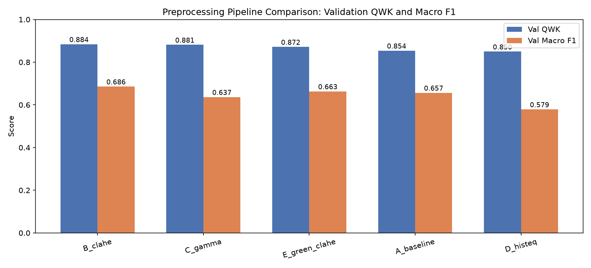

### What the chart shows

Each pipeline has two bars:

- validation QWK
- validation macro F1

### What it implies

- `B_clahe` leads on both primary metrics.
- `C_gamma` is close on QWK but lower on macro F1, meaning its ordinal agreement is strong while its average class-wise balance is weaker.
- `E_green_clahe` is competitive but does not surpass CLAHE on luminance.
- `D_histeq` is lowest on both metrics.

### Why macro F1 is important here

Macro F1 gives equal weight to every class. It therefore exposes weak performance on Severe and Proliferative cases that could be hidden by the large No DR group.

---

## 9. Validation confusion matrices

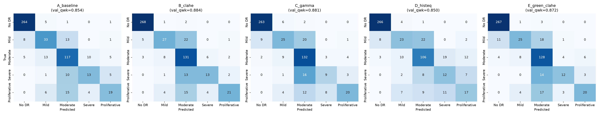

### How to read the chart

Rows are true classes and columns are predicted classes. Diagonal cells are correct predictions. Off-diagonal cells show errors.

### Main implications

- All pipelines classify No DR very well.
- Moderate is also learned reasonably well.
- Mild, Severe, and Proliferative are more difficult.
- Most errors occur between neighbouring or nearby disease grades, which is consistent with an ordinal grading problem.
- `D_histeq` produces more spread across incorrect Moderate, Severe, and Proliferative predictions.

### Pipeline-specific observations

- `A_baseline` correctly classifies 33 of 55 Mild validation images, the strongest Mild recall in this set.
- `B_clahe` correctly classifies 131 of 150 Moderate images and 268 of 271 No DR images.
- `C_gamma` has strong Moderate recall but only 9 of 29 Severe images correct.
- `D_histeq` correctly classifies only 106 of 150 Moderate images and has broader confusion with Severe and Proliferative.
- `E_green_clahe` is strong on No DR and Moderate but still confuses many Severe and Proliferative images with Moderate.

### Why the rare classes are difficult

Severe has only 29 validation images, compared with 271 No DR images. The experiment intentionally does not use class weighting or targeted augmentation, so the model receives much less learning signal for the rare classes.

---

## 10. Validation per-class recall

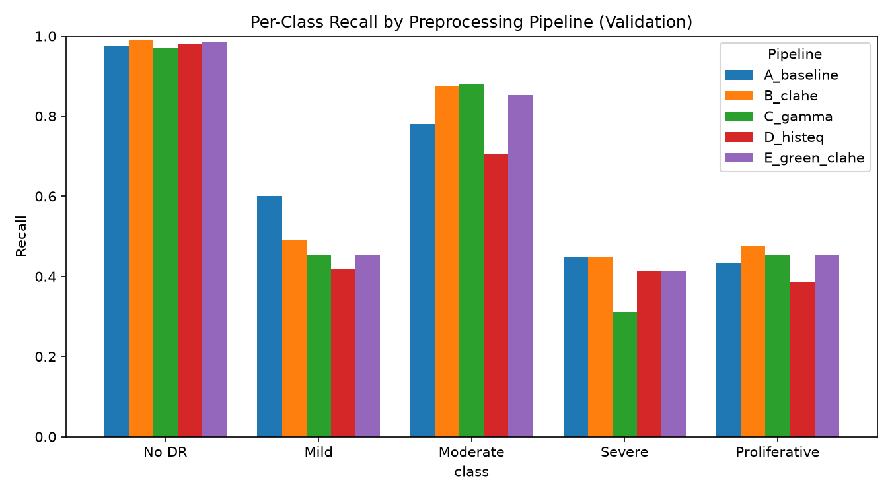

| Pipeline      |           No DR |            Mild |        Moderate |          Severe |   Proliferative |
| ------------- | --------------: | --------------: | --------------: | --------------: | --------------: |
| A_baseline    |           0.974 | **0.600** |           0.780 | **0.448** |           0.432 |
| B_clahe       | **0.989** |           0.491 |           0.873 | **0.448** | **0.477** |
| C_gamma       |           0.970 |           0.455 | **0.880** |           0.310 |           0.455 |
| D_histeq      |           0.982 |           0.418 |           0.707 |           0.414 |           0.386 |
| E_green_clahe |           0.985 |           0.455 |           0.853 |           0.414 |           0.455 |

### What the chart implies

No single pipeline is best for every class.

- `A_baseline` is strongest for Mild.
- `C_gamma` is marginally strongest for Moderate.
- `B_clahe` is strongest overall and performs best or jointly best on No DR, Severe, and Proliferative.
- Severe recall is low for every method.

### Why this matters

A high overall QWK does not guarantee strong recall for every disease grade. In a medical screening context, low Severe recall would require further work even if the overall metric is high.

---

## 11. Validation QWK across epochs

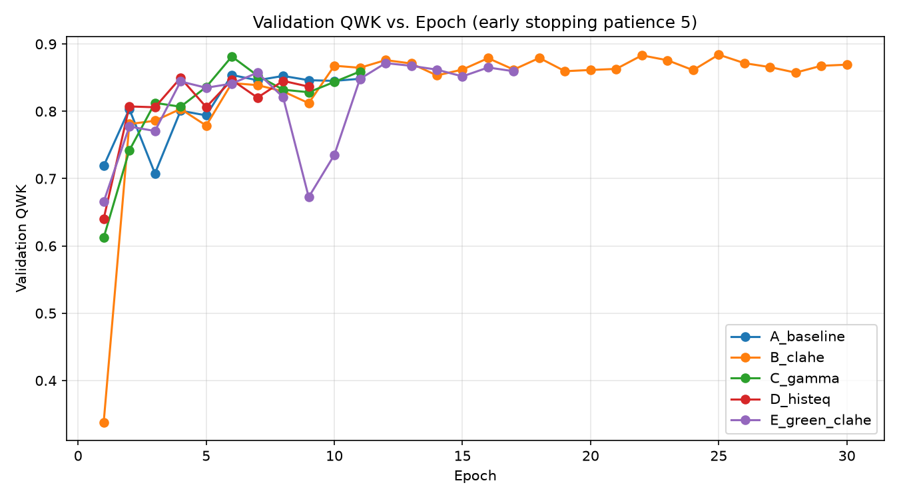

### What the chart shows

It tracks validation QWK after every epoch. Lines stop at different epochs because early stopping ends training after five non-improving epochs.

### What it implies

- Most pipelines reach useful performance within the first few epochs.
- `B_clahe` starts unusually low, then improves rapidly and continues for all 30 epochs.
- `C_gamma` reaches a strong score early and then stops after no further improvement.
- `E_green_clahe` has a temporary drop around epochs 9–10 and then recovers.
- `D_histeq` and `A_baseline` stop earlier because they stop improving sooner.

### Why B_clahe starts low

The first epoch can be noisy because the final ResNet classification layer is newly initialised. A poor first point is not enough to declare instability; the subsequent trend matters more.

### Why later fluctuations occur

Validation QWK is calculated on a finite set of 549 images. Small changes in borderline predictions can move QWK noticeably, especially for minority classes. Learning-rate changes and stochastic optimisation can also produce temporary dips.

### Practical implication

The best checkpoint should be retained rather than the final epoch. The notebook does this by saving the checkpoint with the highest validation QWK.

---

## 12. Training versus validation loss

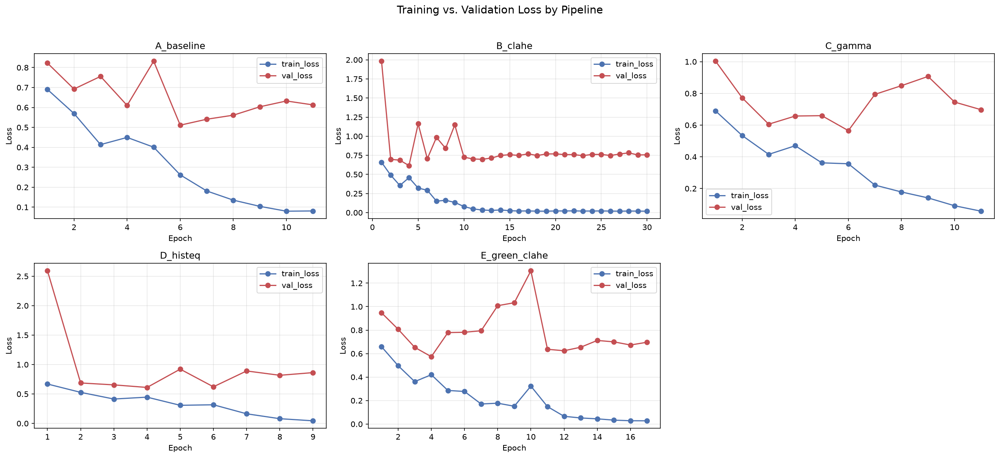

### Overall interpretation

Training loss decreases toward zero for every pipeline, while validation loss remains substantially higher. This is evidence of overfitting: the models continue becoming more confident on training images without equivalent improvement on unseen validation images.

### Pipeline-by-pipeline interpretation

#### A_baseline

Validation loss reaches its lowest point around epoch 6 and then rises while training loss continues to fall. This suggests overfitting after approximately epoch 6.

#### B_clahe

Training loss becomes almost zero, but validation loss remains around 0.70–0.80 after early fluctuations. The large gap indicates the strongest overfitting or probability overconfidence among the pipelines. QWK remains high, so the issue is not necessarily incorrect class ordering; it may partly be poor confidence calibration.

#### C_gamma

Validation loss is lowest around epoch 6, then increases while training loss continues falling. The model learns quickly but later specialises too much to the training set.

#### D_histeq

Validation loss starts extremely high, drops sharply, and then fluctuates. The large initial value suggests the transformed images make the early optimisation problem difficult. Later separation between training and validation loss still indicates overfitting.

#### E_green_clahe

Validation loss falls early, rises sharply around epoch 10, and then settles. The spike corresponds to the temporary QWK drop. Training loss later approaches zero while validation loss stays elevated, showing overfitting.

### Why loss and QWK tell different stories

Cross-entropy is sensitive to probability confidence. A confidently wrong prediction receives a large loss. QWK only uses final predicted classes and their ordinal distance. Therefore, `B_clahe` can have the best QWK while having a higher validation loss than the baseline.

### Modelling implication

Potential next steps include stronger augmentation, dropout, label smoothing, class-aware sampling, weight decay tuning, or probability calibration. These should be tested in a separate experiment so the preprocessing comparison remains controlled.

---

## 13. Held-out test evaluation

### Test metric table

| Pipeline      |   Test accuracy | Balanced accuracy |        Macro F1 |             QWK | Macro precision |    Macro recall |            Loss |
| ------------- | --------------: | ----------------: | --------------: | --------------: | --------------: | --------------: | --------------: |
| B_clahe       | **0.827** |             0.640 |           0.658 | **0.883** |           0.689 |           0.640 |           0.690 |
| A_baseline    |           0.825 |   **0.655** | **0.666** |           0.881 |           0.680 | **0.655** | **0.466** |
| E_green_clahe |           0.825 |             0.645 |           0.664 |           0.879 | **0.696** |           0.645 |           0.576 |
| C_gamma       |           0.813 |             0.638 |           0.656 |           0.874 |           0.683 |           0.638 |           0.530 |
| D_histeq      |           0.782 |             0.600 |           0.598 |           0.850 |           0.601 |           0.600 |           0.579 |

### What the table implies

`B_clahe` retains the highest QWK on unseen test images, supporting the validation-based selection. However, the margin over `A_baseline` is small.

`A_baseline` has the best test macro F1, balanced accuracy, recall, and loss. This means the baseline remains a strong practical alternative, even though it was not selected by the predeclared primary metric.

### Important methodological point

The test set must not be used to revise the selection rule after seeing the results. The correct conclusion is that `B_clahe` wins under validation QWK, while the test results reveal that the baseline is highly competitive and may be preferable under other objectives.

---

## 14. Test metric comparison chart

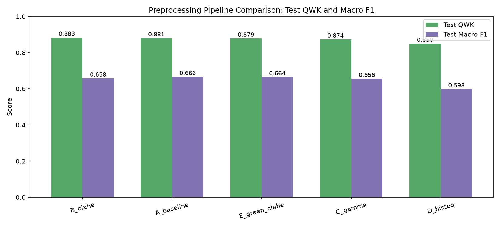

### What the chart implies

- The test QWK ranking is close to the validation ranking.
- `B_clahe` has the highest QWK.
- `A_baseline`, `E_green_clahe`, and `C_gamma` are close together.
- `D_histeq` remains clearly weakest.
- Macro F1 values are more tightly grouped, with the baseline slightly highest.

### Why the ranking changes slightly

Validation and test sets contain different individual images. Small ranking changes are expected when pipelines are close in performance. Stable broad ordering is more important than exact rank consistency.

---

## 15. Test confusion matrices

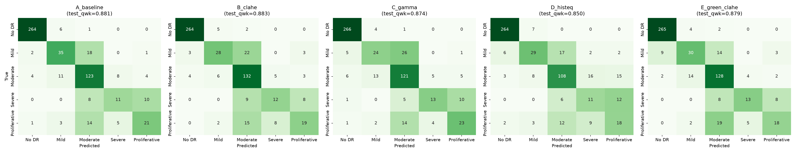

### Main implications

The same pattern appears on unseen data:

- very strong No DR classification
- good Moderate classification
- much weaker Mild, Severe, and Proliferative recall
- many errors occur toward Moderate, suggesting the model often uses the large central class as a fallback

### Notable examples

- `B_clahe` correctly identifies 132 of 150 Moderate images, the strongest Moderate result.
- `A_baseline` correctly identifies 35 of 56 Mild images, the strongest Mild result.
- `C_gamma` correctly identifies 23 of 44 Proliferative images, the strongest Proliferative result.
- `D_histeq` remains weaker on Moderate and spreads more predictions into Severe and Proliferative.
- Severe remains difficult for every pipeline, with only 11–13 of 29 cases correctly classified.

### Why consistency matters

The similarity between validation and test confusion patterns suggests the observed weaknesses are systematic rather than a one-split accident.

---

## 16. Test per-class recall

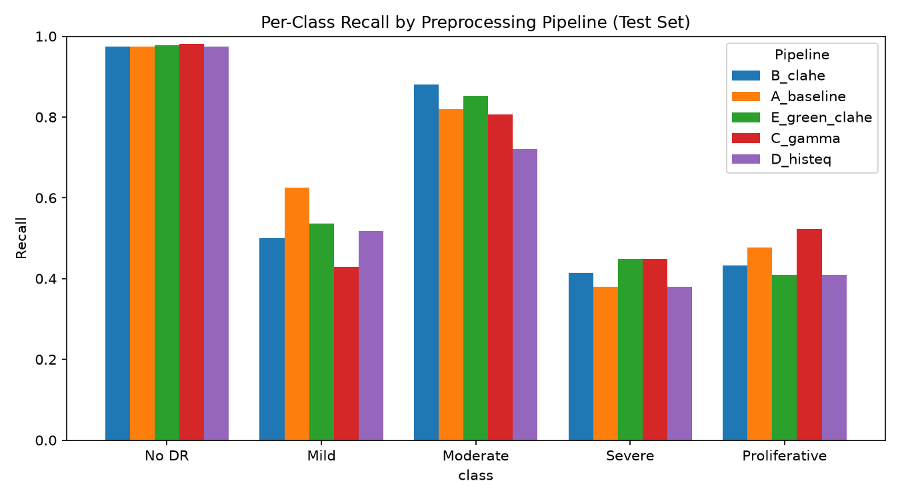

| Pipeline      |           No DR |            Mild |        Moderate |          Severe |   Proliferative |
| ------------- | --------------: | --------------: | --------------: | --------------: | --------------: |
| A_baseline    |           0.974 | **0.625** |           0.820 |           0.379 |           0.477 |
| B_clahe       |           0.974 |           0.500 | **0.880** |           0.414 |           0.432 |
| C_gamma       | **0.982** |           0.429 |           0.807 | **0.448** | **0.523** |
| D_histeq      |           0.974 |           0.518 |           0.720 |           0.379 |           0.409 |
| E_green_clahe |           0.978 |           0.536 |           0.853 | **0.448** |           0.409 |

### What this implies

`B_clahe` is not uniformly superior. Its main advantage is strong ordinal performance and excellent Moderate recall. `A_baseline` is best for Mild, while `C_gamma` performs best for Proliferative and jointly best for Severe.

### Why this is important

Different deployment goals could lead to different preferred pipelines. A screening system prioritising advanced disease sensitivity might value Severe and Proliferative recall more than overall QWK. That decision would require a new, predeclared clinical objective and further validation.

---

## 17. Validation versus test generalisation

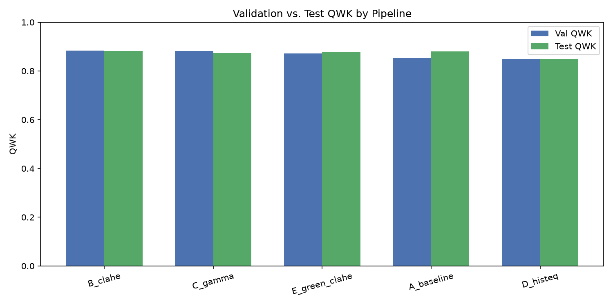

| Pipeline      | Validation QWK | Test QWK | QWK gap | Validation macro F1 | Test macro F1 |
| ------------- | -------------: | -------: | ------: | ------------------: | ------------: |
| B_clahe       |         0.8842 |   0.8828 |  0.0014 |              0.6858 |        0.6579 |
| C_gamma       |         0.8815 |   0.8737 |  0.0078 |              0.6366 |        0.6559 |
| E_green_clahe |         0.8717 |   0.8787 | -0.0070 |              0.6634 |        0.6645 |
| A_baseline    |         0.8540 |   0.8806 | -0.0266 |              0.6566 |        0.6657 |
| D_histeq      |         0.8497 |   0.8498 | -0.0002 |              0.5790 |        0.5983 |

### What the gap means

The gap is validation QWK minus test QWK.

- A value near zero indicates stable generalisation.
- A positive value means test performance is lower.
- A negative value means test performance is higher.

### What the output implies

- `B_clahe` is extremely stable, with only a 0.0014 gap.
- `D_histeq` is also stable, but consistently weaker.
- `C_gamma` drops slightly on test.
- `E_green_clahe` and `A_baseline` perform better on test than validation.
- There is no sign of a large validation-to-test collapse for any pipeline.

### Caution

A small gap does not prove generalisation to new hospitals, cameras, populations, or countries. Both splits come from the same dataset. External validation is still required.

---

## 18. Selected pipeline

The notebook selects:

- **Pipeline:** `B_clahe`
- **Validation QWK:** 0.8842
- **Validation macro F1:** 0.6858
- **Test QWK:** 0.8828
- **Test macro F1:** 0.6579

### Why it is selected

The rule was defined before inspecting test results:

1. highest validation QWK
2. validation macro F1 as a secondary criterion

`B_clahe` wins under that rule and generalises well to the test set.

### File-naming issue

The selected checkpoint is copied to:

`studies/02_preprocessing/best_preprocessing_baseline_checkpoint.pth`

This filename is misleading because the selected pipeline is `B_clahe`, not the baseline. A clearer name would be:

`studies/02_preprocessing/best_preprocessing_checkpoint.pth`

or

`studies/02_preprocessing/best_B_clahe_checkpoint.pth`

The model contents are determined by the copied checkpoint, but clearer naming reduces the risk of using the wrong model later.

---

## 19. Quality-metric box plots

### 19.1 Structural similarity

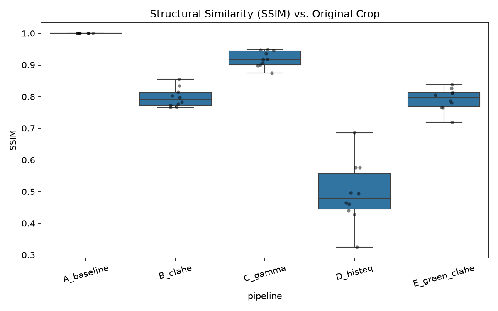

`A_baseline` is exactly 1.0 because it is the comparison reference. `C_gamma` preserves structure most closely among enhanced methods. `D_histeq` has the lowest and most variable SSIM, confirming aggressive transformation.

### 19.2 Brightness

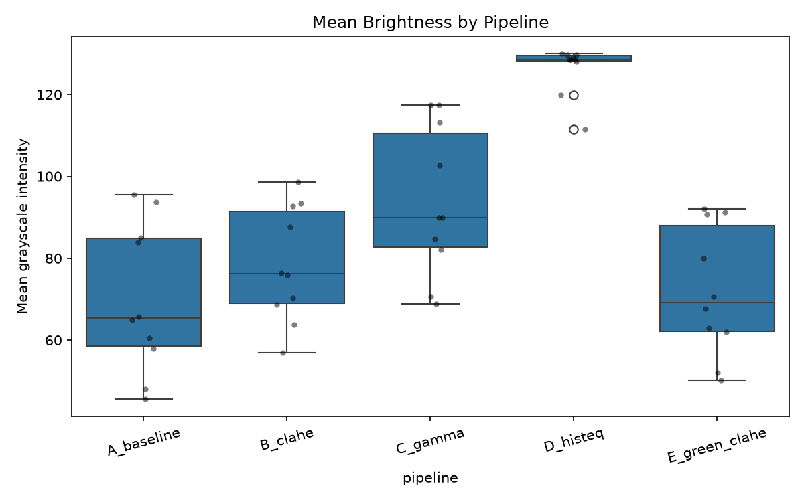

`D_histeq` produces much brighter images than every other pipeline. `C_gamma` also increases brightness, while `B_clahe` and `E_green_clahe` remain closer to the original range.

### 19.3 RMS contrast

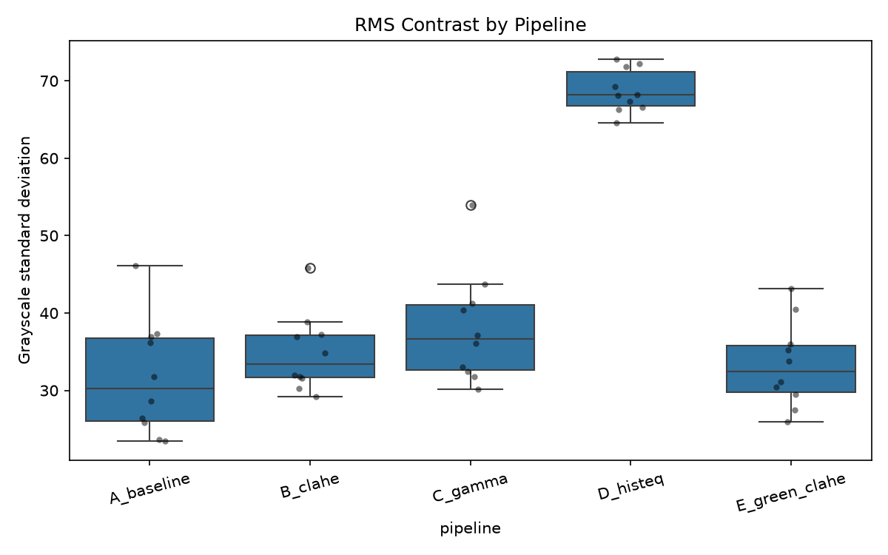

`D_histeq` nearly doubles contrast relative to the baseline sample mean. `B_clahe` provides a smaller, more controlled increase. This supports the interpretation that local enhancement is less destructive than global equalisation.

### 19.4 Entropy

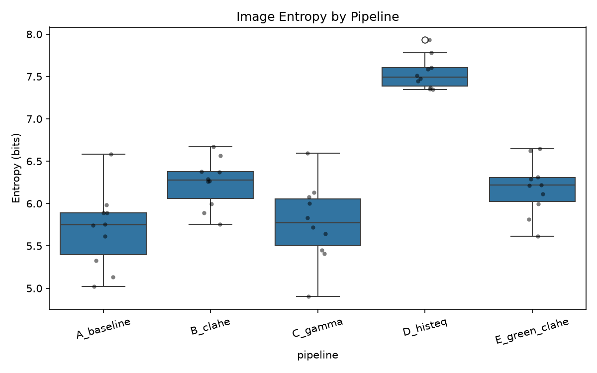

`D_histeq` has the highest entropy. This does not necessarily mean it contains more medically useful information; it may reflect amplified texture or noise. `B_clahe` and `E_green_clahe` increase entropy moderately.

---

## 20. Preprocessing-speed benchmark

The notebook processes 200 training images with each transformation:

| Pipeline      | Images | Total seconds | Milliseconds per image |
| ------------- | -----: | ------------: | ---------------------: |
| A_baseline    |    200 |        19.566 |       **97.832** |
| B_clahe       |    200 |        28.172 |      **140.858** |
| C_gamma       |    200 |        24.397 |      **121.987** |
| D_histeq      |    200 |        21.450 |      **107.249** |
| E_green_clahe |    200 |        20.207 |      **101.035** |

### What this implies

- `A_baseline` is fastest.
- `E_green_clahe` and `D_histeq` are only slightly slower.
- `C_gamma` has moderate overhead.
- `B_clahe` is slowest at about 141 ms per image.

### Why B_clahe is slower

CLAHE divides the luminance image into tiles and performs local histogram operations, which requires more computation than simple resizing or a lookup-table gamma transform.

### Practical meaning

At these measured speeds, processing 10,000 images would take roughly:

- baseline: about 16 minutes
- B_clahe: about 23.5 minutes

This rough estimate assumes the same hardware and serial processing conditions. Actual deployment speed can differ with CPU, storage, parallelism, caching, and batch design.

### Correction to the notebook narrative

The displayed speed table shows `B_clahe` at **140.858 ms per image**, not about 97 ms. The report uses the measured table values.

---

## 21. Combined summary

### What the table implies

- `B_clahe` is the strongest validation-QWK pipeline and remains first on test QWK.
- `A_baseline` is simpler, faster, and highly competitive on test metrics.
- `C_gamma` preserves structure well and performs strongly on advanced-class recall, but does not lead overall.
- `E_green_clahe` is competitive but loses original colour information.
- `D_histeq` is consistently weakest and changes the images most aggressively.

The title in the original figure says “Study 1 Summary Table,” although this is the preprocessing notebook. This is only a presentation-label issue and does not affect the values.

---

## 22. Final conclusion

Under the predeclared validation-QWK selection rule, **B_clahe is the recommended preprocessing pipeline**.

Its strengths are:

- highest validation QWK: 0.884
- highest test QWK: 0.883
- highest validation macro F1: 0.686
- very small validation-to-test QWK gap
- moderate contrast enhancement without the extreme structural change caused by global histogram equalisation

However, the result is nuanced:

- `A_baseline` is almost tied on test QWK and has better test macro F1, balanced accuracy, and loss.
- `C_gamma` performs better on some advanced classes.
- No pipeline solves low Severe recall.
- All pipelines show overfitting in the loss curves.
- The experiment uses one architecture, one seed, one dataset, and no external validation.

### Recommended next experiment

Keep `B_clahe` as the preprocessing baseline and test modelling improvements separately:

- class-weighted or focal loss
- balanced sampling
- targeted augmentation for Mild, Severe, and Proliferative classes
- label smoothing or probability calibration
- ordinal regression loss
- stronger regularisation
- cross-validation or multiple random seeds
- external dataset evaluation

The selected pipeline should be described as the best **for this dataset, split, model, metric, and experimental setup**, not as proof of clinical superiority.
